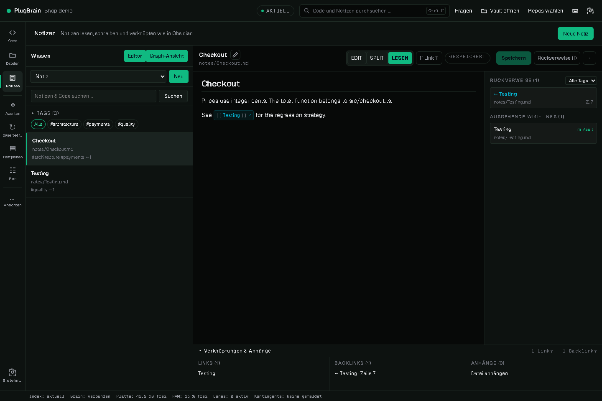
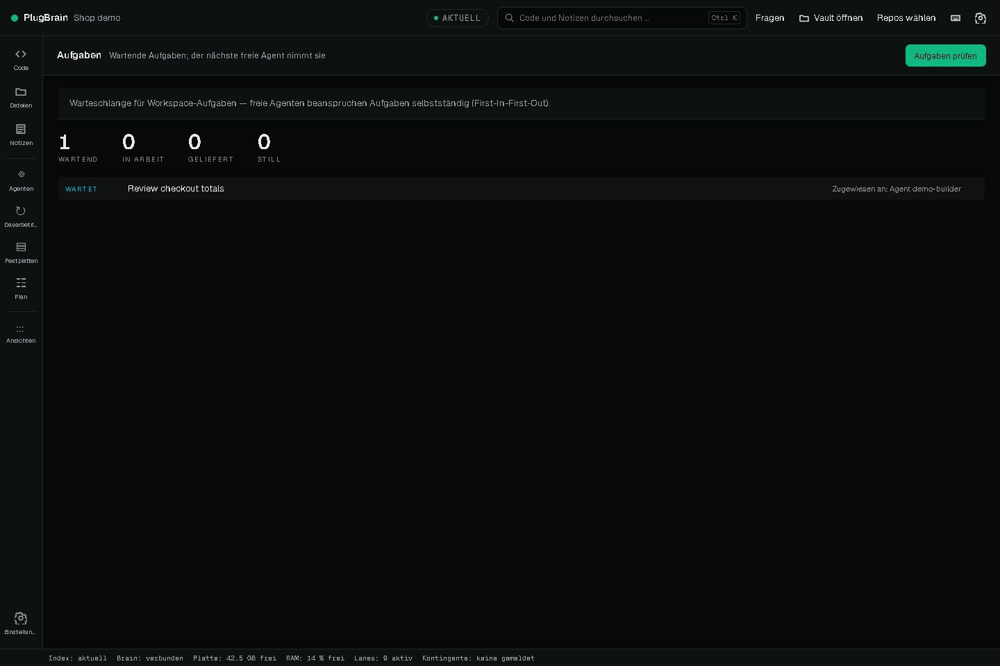

# PlugBrain


**Shared code knowledge, project notes and accountable agent coordination on your machine.**

PlugBrain indexes your project into one SQLite store. Use it to find definitions and callers, navigate linked Markdown notes, and coordinate coding agents through tasks, path claims, messages and delivery evidence. It runs without PlugPT, Freebuff, an API key or a cloud account. Your coding client chooses its own model; PlugBrain does not host an LLM.

[Start from source](docs/quickstart.md) · [Documentation](docs/index.md) · [Agent integration](docs/agents/README.md) · [Channels and downloads](docs/channels.md) · [Deutsch](README.de.md)



*Actual local Windows candidate 0.7.0-rc.2, using isolated example data. This screenshot is not a claim that this branch contains the candidate or that an installer is publicly available. Image provenance: [capture record](docs/images/showcase.json).*

## Choose a channel

| Channel | What exists | How to use it |
| --- | --- | --- |
| Public source, main | Package version 0.5.0-dev.1; development source | Node.js 24+, npm, Git; see the candidate [source quickstart](docs/quickstart.md) |
| Published tag 0.3.1 | GitHub source archives; **zero installer assets** when checked on 4 October 2026 | Browse the [release](https://github.com/litbitrim/plugbrain/releases/tag/0.3.1); source archives are not an app installer |
| Public candidate 0.6.0-rc.1 | Open [PR 6](https://github.com/litbitrim/plugbrain/pull/6), not merged | Review its pinned source and CI; it is not the main channel |
| Local candidate 0.7.0-rc.2 | Local source and unsigned Windows QA artifact, shown above | Publication, independent review, exact CI and signed installation remain pending |

There is currently no verified public Windows installer or macOS/Linux app archive in Releases. Do not look for a missing download button. [Channels](docs/channels.md) separates source, local preview and installed release.

## Start with one project

Install Node.js 24 or newer, npm and Git. These commands select the reviewed-entry candidate branch, which includes the explicit-folder and standalone-notes fixes. It is a draft candidate, not merged main:

```sh
git clone --branch codex/brain-public-entry-20261004 --single-branch https://github.com/litbitrim/plugbrain.git
cd plugbrain
npm ci
node --experimental-strip-types src/cli.ts init ../my-project --no-clients --no-agents-file
node --experimental-strip-types src/cli.ts serve
```

Replace `../my-project` with your own folder. Open the loopback URL printed by `serve`; the default is http://127.0.0.1:4310. The first command indexes only the chosen project and leaves client configuration and agent instruction files alone. All data stays in `~/.plugbrain` unless you explicitly choose another `PLUGBRAIN_HOME`. For a safe trial, use a separate home as described in the [quickstart](docs/quickstart.md).

### Knowledge without an agent

Open **Notizen** for Markdown documents, tags and wiki links, or **Code** for definitions and callers. Files remain ordinary project files; the index is a local projection. Notes and code can be explored without buying tokens or logging into another product.

### Give one agent project context

Use an existing MCP client or the CLI. Review a client setup with `node --experimental-strip-types src/cli.ts setup codex --dry-run` before applying it; setup backs up edited configuration. The [client guides](docs/agents/README.md) name each file, verification step and undo path. Ask the client to find the code for your task, inspect callers and cite the source it used. MCP supplies context and controls; it does not automatically create or execute workers.

### Coordinate a team

Register distinct worker identities, queue bounded work, claim paths before edits, and retain the resulting commit and delivery evidence. The [agent protocol](docs/agent-protocol.md) defines turn and message discipline; the [CLI reference](docs/cli.md#swarm) describes the commands. A board state or successful message does not prove a worker edited, tested, delivered or integrated anything. Claims coordinate cooperating agents; they are not an OS sandbox.



*The review task is queued and assigned to a registered demonstration agent. No provider call or coding worker was started for this capture.*

## Capabilities and limits

- Code intelligence: AST-derived symbols, callers, context, impact, changed files and graph queries. Accuracy depends on the parser, language and indexed revision.
- Project knowledge: Markdown notes, wiki links, backlinks, tags, attachments and cited context packs.
- Coordination: shared tasks, turn states, messages, path claims, resource admission and commit approval. Delivery, independent review and integration are separate facts.
- Local operation: loopback HTTP UI/API, SQLite data, MCP and CLI. The UI is primarily German; documentation is primarily English.
- Windows is the locally exercised host. macOS/Linux CI and packaging are separate evidence; a local Windows success is not platform parity.

The public source and local candidate have different implementation states. Historical benchmark numbers do not establish current technical superiority. Compare pinned versions, raw answers and the actual acceptance criteria before adopting a result. [Development](CONTRIBUTING.md), [security](SECURITY.md) and [HTTP API](docs/http-api.md) explain the operating details.

## Privacy and licensing

PlugBrain performs indexing and stores project data locally. The HTTP service binds to 127.0.0.1, uses a generated authentication token and does not offer a public cloud endpoint. Never publish the data home, private notes, tokens or provider credentials. External AI clients have their own data policies.

[MIT](LICENSE) · [Changelog](CHANGELOG.md) · [Issues](https://github.com/litbitrim/plugbrain/issues)
