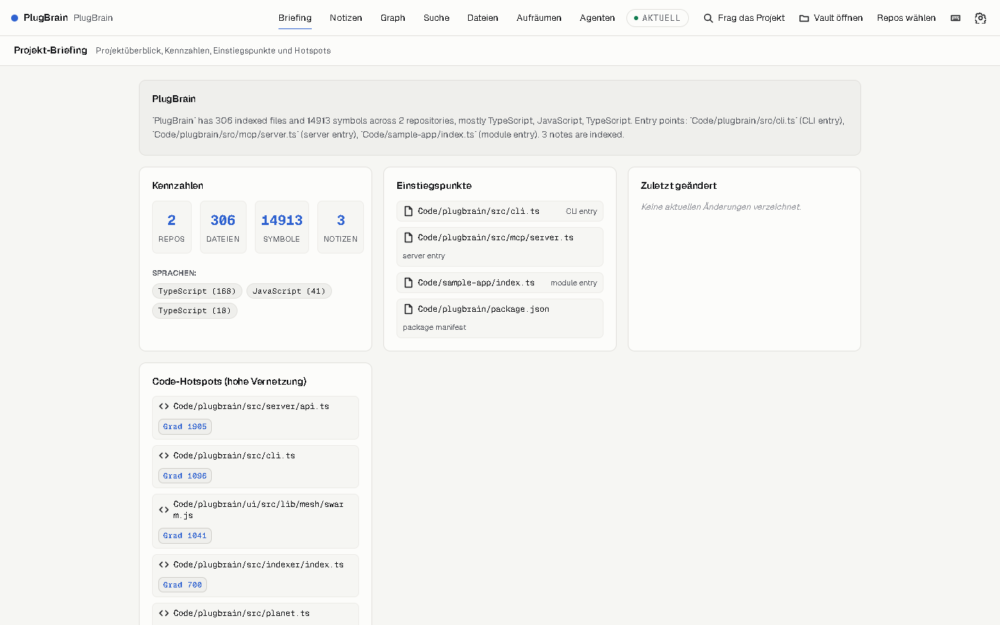
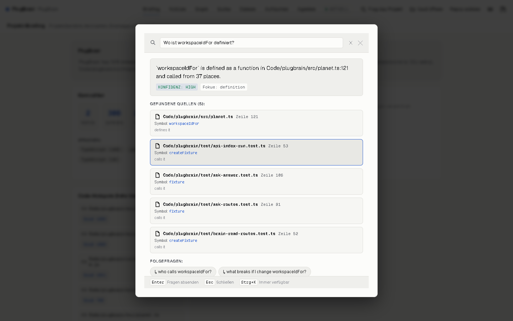
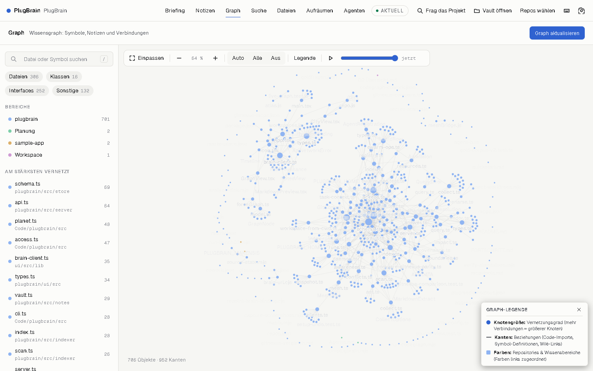
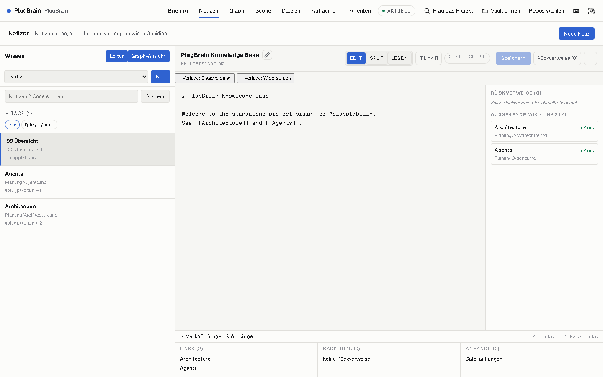
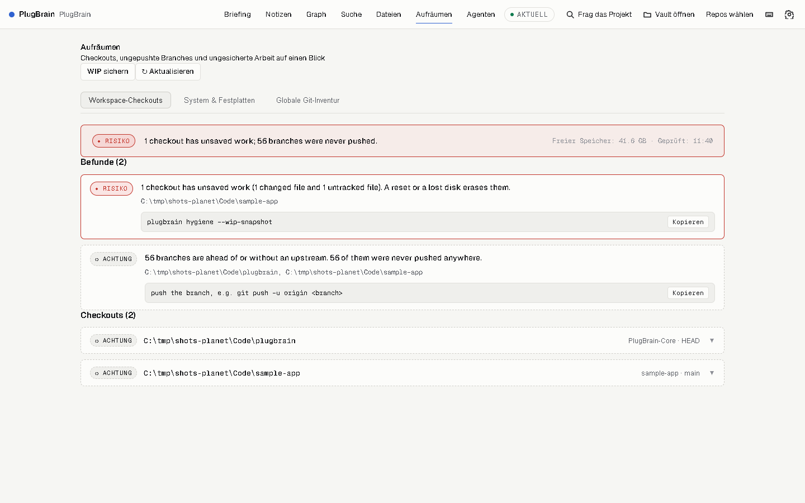

# PlugBrain

[](https://github.com/litbitrim/plugbrain/actions/workflows/ci.yml)

**PlugBrain is a local project and code memory for AI agents** — real AST-based
code intelligence over your repositories plus an Obsidian-style note vault,
exposed to Claude Code (and any MCP client) as one set of tools. Everything
runs on your machine. No cloud, no telemetry.

> The web interface is currently in German. An English interface is planned.
> The CLI, the MCP tools, their answers and all documentation are in English.







## Why PlugBrain?

Code assistants forget. Every session starts from zero: the agent re-reads
files it has already read, misses the note where you wrote down *why* a
decision was made, and steps on other agents editing the same files.
Existing code-graph tools help with the code half of that problem:

- **GitNexus** and **CodeGraph** are good local code-graph tools. Both index
  a codebase and answer symbol, caller and impact questions, both run as a
  CLI and both can serve those answers to an agent over MCP.

What PlugBrain adds is the other half: the project's written knowledge and
the agents working on it, in the same local brain as the code.

| | GitNexus | CodeGraph | PlugBrain |
| --- | --- | --- | --- |
| Code intelligence (symbols, callers, impact) | ✓ | ✓ | ✓ |
| Local CLI and MCP server | ✓ | ✓ | ✓ |
| Obsidian-style notes vault with code bindings | – | – | ✓ |
| Multi-agent claims, fencing and awareness | – | – | ✓ |
| Plain-language `ask` with cited sources | – | – | ✓ |
| Git hygiene: unsaved work across all checkouts | – | – | ✓ |

The "–" marks reflect the tools' documented commands as of September 2026.
If one of them has since gained a feature, please open an issue and we will
correct the table.

### How it measures up

We compared PlugBrain with CodeGraph and GitNexus on 120 questions (definitions, callers, impact, config keys, docs) across four of the author's own projects. PlugBrain itself is not one of them. We wrote the questions ourselves. 40 of them were frozen before any tuning and serve as the honest holdout. Every tool was driven through its documented command-line interface, and every raw answer is stored next to the results.

| Tool | Holdout (40) | All questions (120) | Latency p50 | Latency p95 |
| :--- | :---: | :---: | :---: | :---: |
| PlugBrain | 38 / 40 | 106 / 120 | 265 ms (33 ms with the daemon running) | 478 ms |
| CodeGraph | 38 / 40 | 103 / 120 | 280 ms | 311 ms |
| GitNexus | 36 / 40 | 90 / 120 | 1,134 ms | 3,465 ms |

In short, PlugBrain answers three more of the 120 questions than CodeGraph and ties it on the holdout. Its real edge is speed once the daemon is warm, and that it also searches your notes. CodeGraph's call edges are still more complete on deeply polymorphic class hierarchies. Full method, raw answers, hand-checked misses and how to reproduce the run: [bench/v2/RESULTS.md](bench/v2/RESULTS.md).

## Quickstart

**Windows:** download `PlugBrain-<version>-win-x64.exe` from
[Releases](https://github.com/litbitrim/plugbrain/releases) and run it. The
installer bundles a portable Node.js runtime — nothing else to install.

**macOS / Linux:** grab `plugbrain-<version>-<os>-<arch>.tar.gz` from the same
releases page, unpack it and put `bin/plugbrain` on your `PATH`.

Then, inside your project folder:

```bash
# One-time: create the brain store and register this folder as a workspace
plugbrain init

# Start the local brain (UI + API + MCP transport)
plugbrain serve
```

Open `http://localhost:4310` for the cockpit. The data directory defaults to
`~/.plugbrain`; set `PLUGBRAIN_HOME` to choose another location.

### Use it from Claude Code

PlugBrain ships as a Claude Code plugin with its own marketplace entry:

```
/plugin marketplace add litbitrim/plugbrain
/plugin install plugbrain@plugbrain
```

The plugin starts the brain when needed (session hook), and gives Claude the
`skills/brain` skill: *ask the brain first* — context packs before edits,
impact analysis before renames, notes before re-deriving decisions.

## MCP tools

`plugbrain mcp` speaks the Model Context Protocol over stdio, giving agents instant access to code intelligence and knowledge:

- `ask` — Ask in plain language; routes to the right tool and returns one clear sentence with source citations.
- `context_pack` — Build goal-oriented context packs with relevant files, symbols, and dependencies.
- `query` — Concept search across indexed AST symbols, file paths, and notes.
- `context` — 360-degree symbol context: callers, callees, and execution flow memberships.
- `impact` — Blast-radius analysis showing upstream and downstream dependency changes before editing.

For the full reference of all tools (including search, notes, git hygiene, and multi-agent coordination), see [MCP Tools Reference](docs/mcp-tools.md).

## Privacy

- Everything stays on your machine: the store is a single SQLite database
  under `PLUGBRAIN_HOME`, indexing runs locally, the UI is served locally.
- No telemetry, no analytics, no phone-home. The only network traffic is the
  local HTTP server on `127.0.0.1`.
- The HTTP API requires a bearer token that is generated on first start and
  kept in `<PLUGBRAIN_HOME>/auth.token`.

## Development

```bash
git clone https://github.com/litbitrim/plugbrain
cd plugbrain
npm install
npm test          # unit + integration tests (node:test)
npm run serve     # start the brain against the current folder
```

See [CONTRIBUTING.md](CONTRIBUTING.md) for details.

## License

[MIT](LICENSE) — Copyright (c) 2026 litbitrim
